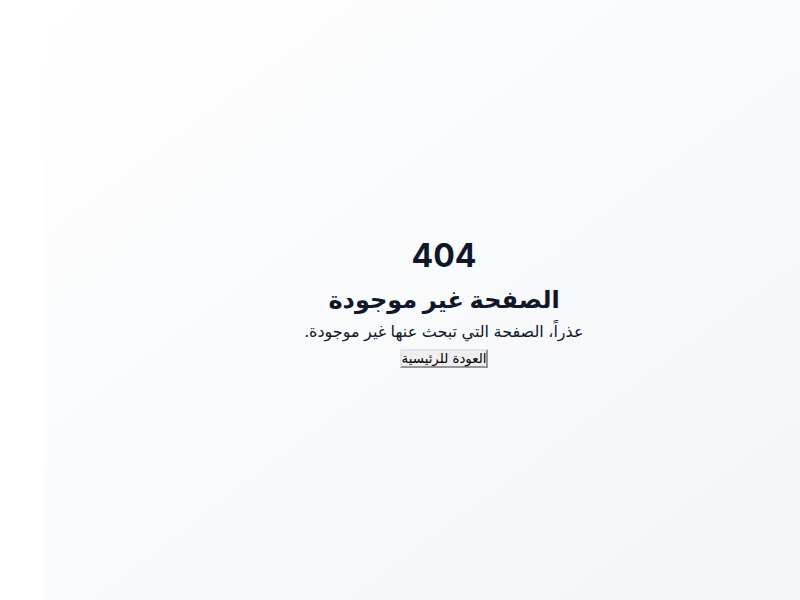
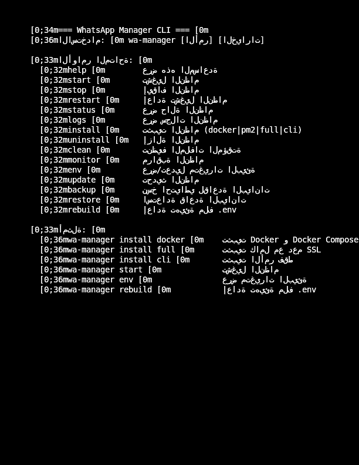

# WhatsApp Manager

إدارة جلسات واتساب عبر واجهة ويب تعتمد على **Node.js** و **Next.js**.
يُوفِّر المشروع لوحة تحكم، API REST، ودعم WebSocket للبث الفوري. يمكن تشغيله محليًا
أو داخل حاويات Docker.

## المزايا الرئيسية
- إدارة عدة أجهزة واتساب من واجهة موحدة
- واجهة مبنية بـ Next.js و React
- قاعدة بيانات SQLite بسيطة مدمجة
- خادم WebSocket اختياري للتنبيهات الفورية
- سكربت CLI (`wa-manager.sh`) للتحكم السريع وتشغيل الحاويات

## المتطلبات
 - Node.js **20** أو أحدث
- Docker و Docker Compose (للتشغيل داخل الحاويات)
- Git

## طريقة التثبيت السريع
تأكد من استخدام **Node.js 20** أو أحدث. يحتوي المستودع على ملف
`.nvmrc` يمكن استعماله مع `nvm` لاختيار الإصدار الصحيح.
```bash
# استنساخ المستودع
git clone <repository-url>
cd whatsapp-manager

# تأكد من استخدام Node.js إصدار 20 أو أحدث. يحدد الملف `.nvmrc` هذا الإصدار.

# تثبيت الاعتماديات
PUPPETEER_SKIP_DOWNLOAD=1 npm install --ignore-scripts

# تشغيل الخادم في وضع التطوير
npm run dev
# تشغيل خادم WebSocket
npm run ws
```

**Note:** Install dependencies with `PUPPETEER_SKIP_DOWNLOAD=1 npm install --ignore-scripts` to skip Puppeteer downloads.
The included `.npmrc` also sets `--legacy-peer-deps` to avoid peer-dependency conflicts with Jest packages.
Make sure to copy the file when building Docker images so the flag is honored there.
The `wa-manager install full` command now copies dotfiles (including `.npmrc`) to `/opt/whatsapp-manager` automatically.

### Production

For a production build you can use Docker:

```bash
docker-compose up --build -d
```
يُنشئ ملف `docker-compose.yml` حاوية للتطبيق وأخرى لـ Nginx. يتم تشغيل
السكربت `start-production.sh` داخل الحاوية لتهيئة البيئة وتشغيل WebSocket عند
تفعيل `ENABLE_WEBSOCKET=true`.

## إعداد ملف البيئة
انسخ الملف المثال وعدّل القيم بما يناسبك:
```bash
cp .env.example .env
```
إذا لم تقم بإنشاء الملف يدويًا فسيقوم أمر `npm run build` تلقائيًا
بإنشاء `.env` من المثال مع توليد قيمة عشوائية لـ `JWT_SECRET`.

### تحذير أمني
قبل تشغيل التطبيق في بيئة الإنتاج، تأكد من تغيير المتغيرات الافتراضية
مثل `ADMIN_USERNAME`, `ADMIN_PASSWORD` و`JWT_SECRET` في ملف البيئة أو داخل
`docker-compose.yml`. استخدام القيم الافتراضية قد يعرّض النظام للاختراق.
يعتمد ملف `docker-compose.yml` على هذه المتغيرات بدون قيم افتراضية، لذلك
يجب تعريفها في ملف `.env` أو في متغيرات النظام قبل تشغيل الحاويات.
### شرح المتغيرات
- `ADMIN_USERNAME` و`ADMIN_PASSWORD`: بيانات الدخول للوحة التحكم ويجب
  تحديدهما قبل تشغيل الحاويات.
- `JWT_SECRET`: مفتاح التوقيع للرموز ويعد متغيراً إلزامياً للإنتاج.
- `JWT_EXPIRES_IN` و`REFRESH_TOKEN_EXPIRES_IN`: مدة صلاحية التوكنات.
- `PORT` و`HOST`: إعدادات الخادم الرئيسي.
- `DATABASE_PATH`: مسار قاعدة البيانات (الافتراضي `./data/whatsapp_manager.db`).
  أثناء بناء صورة Docker يتم تعيين المتغير إلى مسار مؤقت داخل `/tmp`
  لتجنب تعارضات SQLite، ويُعاد إلى المسار الافتراضي عند التشغيل.
- `ENABLE_WEBSOCKET` و`WEBSOCKET_PORT`: تشغيل خادم WebSocket وتحديد المنفذ.
- `NEXT_PUBLIC_WEBSOCKET_URL`: عنوان الاتصال من الواجهة ويجب أن ينتهي بالمسار `/ws/socket.io`.
- `LOG_LEVEL`: مستوى السجلات (`debug`، `info`، إلخ).
- `RESTART_POLICY`: سياسة إعادة تشغيل الحاويات عند استخدام Docker.

بقية المتغيرات موثقة داخل الملف `.env.example` ويمكن تعديلها حسب الحاجة.

## الإعداد الأولي
بعد ضبط ملف البيئة يمكن تشغيل الأمر التالي مرة واحدة لإنشاء ملف `.env`
وقاعدة البيانات الافتراضية:
```bash
npm run setup
```
يولّد الأمر القيم اللازمة في `.env` عند الحاجة ثم يهيئ قاعدة البيانات مع
الجداول الافتراضية ومستخدم الإدارة.

## استخدام سكربت CLI
يحتوي المستودع على سكربت `wa-manager.sh` الذي يسهل إدارة الخدمة.
للجعل متاحًا على مستوى النظام:
```bash
sudo cp wa-manager.sh /usr/local/bin/wa-manager
sudo chmod +x /usr/local/bin/wa-manager
```
بعدها يمكن تشغيل الأوامر:
```bash
wa-manager start    # تشغيل الحاويات
wa-manager stop     # إيقافها
wa-manager status   # حالة التشغيل
```
استخدم `wa-manager install full` لإعداد Nginx وشهادة SSL تلقائيًا.

## أوامر Docker و PM2 الشائعة
لإدارة الحاويات يمكن استخدام الأوامر التالية:
```bash
docker-compose up -d      # تشغيل الحاويات في الخلفية
docker-compose stop       # إيقافها
docker-compose logs -f    # متابعة السجلات
```

مع PM2:
```bash
pm2 start ecosystem.config.js       # تشغيل التطبيق
pm2 status                          # عرض الحالة
pm2 restart whatsapp-manager-app    # إعادة التشغيل
pm2 logs whatsapp-manager-app       # متابعة السجلات
```

## نظرة على الواجهة الرسومية والـ CLI
واجهة الويب توفِّر لوحة تحكم لإدارة الأجهزة والرسائل كما في الصورة التالية:



يمكن تنفيذ معظم العمليات عبر سطر الأوامر أيضًا:



## تشغيل الاختبارات
تتطلب الاختبارات وجود جميع الاعتماديات ونسخة من ملف `.env.test`:
```bash
cp .env.test .env
PUPPETEER_SKIP_DOWNLOAD=1 npm install --ignore-scripts
npm test
```
قد تفشل الاختبارات في البيئات غير المهيأة بالكامل لعدم توفر بعض التبعيات.

## التحقق من التنسيق (Lint)
لتشغيل فحص ESLint واستكشاف المشكلات المحتملة:
```bash
npm run lint
```
لإصلاح المشاكل تلقائياً:
```bash
npm run lint:fix
```

## رخصة الاستخدام
[MIT](LICENSE)
